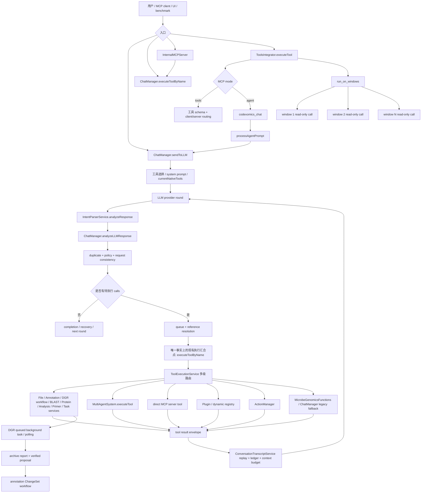
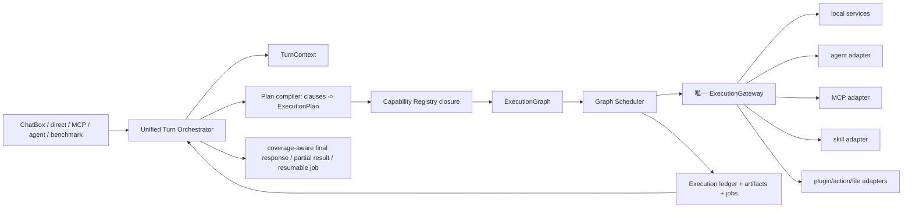

# CodeXomics 多执行管线与 Turn Flow 深度分析

> 本文不是对某份既有报告的续写：`docs/turn-flow-analysis.md` 在本次分析前并不存在，用户提到的“初步分析报告”也未在仓库中找到。因此，本文不假设或补写任何缺失报告内容；以下判断以当前源码、当前单元测试/测试 harness，以及对 `docs/architecture/CodeXomics_Multi_Agent_System_Technical_Specification.md` 的差异核对为事实基线。技术规格中的示例只作为设计意图或历史说明，不自动等同于实现。

## 1. 执行摘要

CodeXomics 当前不是一条单一的“LLM → tool → result”管线，而是多条可互相嵌套的执行管线：

- ChatBox 内部的 native/text tool loop；
- `ToolExecutionService` 的多级本地路由；
- `SmartExecutor` + `FunctionCallsOrganizer` 的类别/优先级批处理；
- `MultiAgentSystem`、`CoordinatorAgent` 及各专用 agent 的路由；
- renderer 内的 `InternalMCPServer` 与 main process 的 `ToolsIntegrator`；
- DGR（Deep Gene Research）异步任务到 annotation ChangeSet 的确定性 workflow；
- Action、Plugin、File、外部 API、后台任务、多窗口 read-only fan-out 等专用路径。

这些管线各自解决了真实问题：provider 协议兼容、工具安全策略、服务拆分、MCP 暴露、多窗口隔离、长任务持久化和 DGR 证据绑定。但它们在“谁负责规划”“谁负责执行”“哪个结果格式是真实格式”“什么时候算完成”“失败后谁可以重试”等问题上存在重叠。结果是：简单请求通常工作良好，组合请求、跨窗口请求、长任务和嵌套 agent 请求则需要多个隐式约定同时成立。

**明确推荐的方向**是：逐步引入 `Unified Turn Orchestrator + TurnContext + ExecutionPlan/ExecutionGraph + 唯一 ExecutionGateway + capability registry + graph scheduler`。它不是一次性重写，而是先观察和双写，再让现有模块收敛到唯一网关，最后以依赖图和明确 completion criteria 取代类别优先级和隐式 round heuristic。

## 2. 当前真实架构

### 2.1 入口与汇合点

当前至少有四类主要入口：

1. **ChatBox 用户输入**：`sendMessage()` / `sendMessageProgrammatically()` 最终进入 `ChatManager.sendToLLM()`。它负责配置检查、上下文、记忆、工具选择、provider round loop、abort、重复抑制、policy、结果回放、早停和 DGR 轮询。
2. **应用内直接工具调用**：UI、其他 renderer 模块或测试可调用 `ChatManager.executeToolByName()`，再进入 `ToolExecutionService.execute()`；这条路径不一定经过 LLM loop。
3. **renderer MCP**：`InternalMCPServer` 收到 IPC 的 `mcp-tool-call`，优先委托 `chatManager.executeToolByName(toolName, parameters, { bypassAgent: true, executionContext })`，并保留旧的 direct handler / ChatManager method fallback。
4. **main process MCP**：`ToolsIntegrator.executeTool()` 校验 schema 后按 tools mode 或 agent mode 路由。agent mode 对大多数工具包装成自然语言，转交 `codexomics_chat`，再回到 renderer 的 `processAgentPrompt()` 和 ChatBox pipeline。

因此，MCP agent mode 不是独立的业务执行器，而是一个“外部 structured call → 自然语言 → 另一个 LLM turn”的嵌套入口。`run_on_windows` 是 main process 侧的多窗口 read-only fan-out 原语；它不等同于普通工具并行。

### 2.2 关键数据流



### 2.3 ChatBox native/text tool loop

`ChatManager.sendToLLM()`（约 `ChatManager.js:5249`）是当前最重的 turn 控制器，主要步骤如下：

1. 设置 `currentMessage`，等待 LLM 初始化并检查 provider 配置。
2. 创建请求级 `executionData`，记录 function calls、results、rounds 和耗时；同时创建 `AbortController`。
3. 读取 multi-agent 开关、最大 round 数、early completion，收集当前 studio context 和 memory context。
4. 构造 `conversationHistory`，在每次 provider call 前调用 `enforceConversationTokenBudget()`。
5. 以 `currentRound < maxRounds && !taskCompleted` 运行 round loop。
6. 通过 `sendMessageWithHistory()` 发送 `currentNativeTools`、`nativeFunctionCalling`、`parallelToolCalls`、streaming callbacks 和 abort signal。
7. 调用 `analyzeLLMResponse()`，然后进行 mid-turn tool expansion、协议修复、重复/策略检查和工具排队。
8. 如果 smart execution 开启且参数不含引用，则把 queue 交给 `SmartExecutor.smartExecute()`；否则顺序执行 `executePendingToolExecutionQueue()`。
9. 将结果加入 reference context，更新结构化 execution ledger，启动 DGR queued task 的 programmatic polling，随后用 `ConversationTranscriptService.appendToolRoundToHistory()` 回放 native 或 text round。
10. 根据成功结果、失败结果、重复抑制、模型停止原因和 completion heuristic 决定继续、修复或结束。

native 与 text 两种协议由 `IntentParserService` 统一为内部 `{ tool_name, parameters, id, source }` 形状。native round 若每个 call 有唯一 `tool_call_id` 且每个 id 都有 result，就以 OpenAI 风格的 assistant `tool_calls` + `role: tool` 回放；否则使用带 `[CodeXomics automated tool-execution record]` 的 user-role prose envelope。这个保护避免 text result 被模型误当成新的用户请求，但也意味着两种历史形状并存。

### 2.4 解析、选择和 mid-turn expansion

`IntentParserService` 的实际职责比旧规格所说的“关键词意图识别”更具体：它识别 OpenAI、Anthropic、Gemini、Responses 等 provider 的结构化字段，也解析兼容的 text JSON；会去除 reasoning block、拒绝任意 prose 中的示例 JSON，并将 malformed call 作为 invalid candidate 暴露给上层。

之后 `ChatManager.analyzeLLMResponse()` 还会：

- informational request 中抑制 state-changing tool；
- 用 `lastSystemPromptMetadata.selectedTools` 拒绝未 advertise 的工具；
- 调用 dynamic registry 的 schema 校验；
- 检查 call 是否与原始请求一致；
- 将 invalid/suppressed/tool-like 状态交给 recovery。

工具选择本身在 round 1 前基于 opening message 和 dynamic registry 做一次。`expandAdvertisedToolsForRejectedCalls()` 可在模型实际请求一个已知但未 advertise 的工具时追加 schema；最多 3 次，并且只追加、不重建 `currentNativeTools` 顺序。它解决了“完全不可达”的问题，但不是完整的 planning：无法保证多 clause coverage，也不知道新工具的输入依赖是否已经满足；未知工具仍然不能执行；每次扩展还会改变 provider request prefix 并影响缓存。

### 2.5 `ToolExecutionService` 的多级路由

`ToolExecutionService.execute()` 先注入受控的 `__executionContext`，处理 legacy aliases 和 call-only benchmark，再进入 `_dispatch()`。当前优先级大致是：

1. agent settings；
2. File、Annotation、DGR `AnnotationResearchWorkflowService`、BLAST、Protein、Genome Analysis、Primer、Task service；
3. 开启时的 `MultiAgentSystem.executeTool()`，带 `activeAgentExecutions` 防递归；
4. 特定或通用 MCP server；
5. dynamic registry / plugin integrator；
6. ActionManager；
7. `MicrobeGenomicsFunctions`；
8. ChatManager camelCase native fallback；
9. `executeLocalTool()` legacy fallback。

这个顺序有现实价值：新服务可以覆盖旧实现，MCP/插件可以逐步接入，agent 失败后还能降级。但“返回 `undefined`”“返回 `{success:false}`”“抛异常”“agent 返回 wrapper 后再解包”在不同层有不同含义。`InternalMCPServer` 又有一套 ChatManager 优先、switch fallback、直接 method fallback；`ToolsIntegrator` 还按工具模块再分一次 server/client routing。因此这里是多个 fallback 层叠，而不是一个可审计的 capability resolution。

### 2.6 `SmartExecutor` 与 `FunctionCallsOrganizer`

`SmartExecutor.smartExecute()` 把输入标准化后调用 `FunctionCallsOrganizer.optimizeExecution()`。`FunctionCallsOrganizer`：

- 维护大量手工 `functionCategories`；
- 将工具映射到 `browserActions`、`dataRetrieval`、`sequenceAnalysis`、`advancedAnalysis`、`blastSearch`、`dataManipulation`、plugin、database、export、coordination、benchmark、primer 等类别；
- 用字符串关键词推断类别；
- 以 numeric priority 构造 phases；
- 仅在同一 phase 内通过 `parallelizable` 决定并行；
- 对 file loading 强制顺序，对多数其他类别默认允许并行。

`SmartExecutor` 的并行执行使用 `Promise.allSettled`，顺序执行逐工具 await，并把结果统一成自己的 `{tool, parameters, success, result, error, executionMode}`。它不解析工具间引用，也没有读写集合、锁或真正的依赖图。`ChatManager` 已经在没有引用时才允许 SmartExecutor，失败时又把原工具放回标准 queue；所以 SmartExecutor 是可选的第二个执行策略，不是唯一执行器。

### 2.7 Multi-Agent / Coordinator

`MultiAgentSystem` 的真实 constructor 是 `constructor(chatManager, configManager)`，维护 `agents`、`agentCapabilities`、EventTarget event bus、cache、metrics、learningData、activeWorkflows 和 resource manager，并注册 Navigation、Analysis、Data、External、Plugin、DeepResearch、Coordinator 等 agent。它根据 `agent.canExecute()`、资源、历史指标、上下文相关性和 `isSpecializedAgent()` 评分选择 agent。

`AgentBase` 同时承载 capability 检查、tool mapping、currentTasks、taskQueue、资源使用、性能统计、学习数据、事件和失败事件。`CoordinatorAgent` 的协调工具包括 decomposition、workflow、assignment、retry、fallback、parallel execution 等；其 `performExecution()` 又优先调用 `ChatManager.executeToolByName(..., { bypassAgent: true })`，失败才使用本地实现。这说明 Coordinator 既是规划者又是执行代理，并且执行最终仍回到 ChatManager/ToolExecutionService。

Multi-agent 当前更接近“按工具选择专用 handler + 记录指标/缓存”的路由层，而不是一个拥有独立、可靠 DAG 生命周期的 workflow engine。`CoordinatorAgent` 的部分 decomposition 依据 `task.type` 生成固定 subtask；`executeSubtasks()` 逐 assignment 执行并以 `Promise.race` 做 timeout，但没有把 dependency graph 交给通用 scheduler。

### 2.8 MCP tools、agent mode 与多窗口

`ToolsIntegrator` 在 tools mode 返回整合后的工具集合；在 agent mode 明确限制为 `codexomics_chat`、`list_genome_windows`、`switch_active_window`（源码注释和项目规则均要求保持此限制）。agent mode 对其他工具构造自然语言 prompt，丢失一部分原始 structured call 语义，虽然在 `context.original_tool` / `original_parameters` 中保留了旁路信息。

`InternalMCPServer` 在 renderer 内接收 IPC，先做 `expected_genome` 校验，再委托 ChatManager；当 ChatManager 没有实现时保留 direct fallback。它对 `codexomicsChat` 特判并直接进入 `processAgentPrompt()`，避免把 agent wrapper 当普通 ChatManager tool。

多窗口方面，`ToolsIntegrator._addWindowTargetingParams()` 给多数 genome tool 增加可选 `windowId` 和 `expected_genome`；main server 维护 focus、active window 和 per-session pin；`run_on_windows` 只允许按名称判定为 read-only 的工具，限制 inner tool、窗口集合和并发，逐窗口隔离失败并保留结果顺序。测试已经验证：明确 windowId、不明确时的歧义报错、focus/active fallback、per-client pin 隔离、genome mismatch 和 fan-out partial failure。

### 2.9 DGR / annotation workflow 与其他管线

`AnnotationResearchWorkflowService` 是当前最接近“确定性 workflow”的实现。它通过 workspace snapshot、runs lock、sidecar 持久化、容量限制、target binding hash、current annotation snapshot/hash、intent hash、idempotency key、DGR task 状态、报告归档、citation/current-annotation validation 和 proposal hash，把异步研究和 annotation ChangeSet 绑定起来。

关键事实：

- `startAnnotationResearch()` 先解析稳定 annotation target，校验 feature type、organism、当前 annotation 和重复策略；
- DGR 返回 queued task 时，ChatManager 立即启动 `startDgrTaskPollingFromResults()`，模型不应自行轮询或重提交；
- 完成后报告需归档，proposal 存储并做完整性验证；
- `create_annotation_changeset` 若 `researchRun` 指向真实 task，存档 proposal 是权威来源，caller 传入的 `annotationProposal` 必须 byte-for-byte 一致，否则拒绝；
- synthetic `rollback:<id>` 等不指向任务的 run id 仍可走豁免路径。

Action、Plugin、File 和后台任务没有同一套持久化语义：Action 通过 `execute_actions` 进入 `ActionManager`；Plugin 可能经过 `PluginFunctionCallsIntegrator` 或 `PluginManager`；File 任务由服务或 ChatManager legacy 方法处理；DGR 明确是分钟级后台任务，其他外部 API/BLAST 是否排队、是否可恢复则依工具实现而不统一。

## 3. 优点、缺点与风险分级

### 3.1 已有优点

- **协议兼容性强**：`IntentParserService` 同时处理 native 和 text，区分 reasoning、可执行 JSON 和示例 JSON；`ConversationTranscriptService` 能按 call id 正确回放 native round。
- **安全护栏较完整**：`ToolExecutionPolicy` / `ToolCapabilityPolicy` 对文件、编辑、导航、重复 UI、外部 API、DGR polling、benchmark 等设有显式规则；结果 ledger 优先于 prose grep。
- **失败不会轻易吞掉**：`Promise.allSettled`、显式 `{success:false}` 识别、tool error feedback、abort sticky state、context budget 和 bounded recovery 均有测试。
- **兼容性现实**：工具 aliases、服务容器、MCP、dynamic registry、plugin、ActionManager 和 legacy path 可以共存，降低一次性迁移成本。
- **DGR 绑定严谨**：workspace、hash、archive、proposal integrity 和 ChangeSet 绑定已经比普通 LLM tool loop 更接近可审计业务流程。
- **多窗口边界已有基础**：`windowId`、`expected_genome`、session pin 和 read-only fan-out 处理了“错窗口读数据”的高风险问题。
- **测试方法正确**：`test/helpers/agent-loop-harness.js` 驱动真实 `sendToLLM()`，而不是只 regex/eval 私有代码；已有测试覆盖 loop、abort、duplicate、mid-turn expansion、agent recursion、MCP routing、DGR binding 和 benchmark 隔离。

### 3.2 P0：可能导致错误副作用、错误数据或不可恢复状态

1. **规划职责重叠**：ChatManager round loop、`FunctionCallsOrganizer` priority plan、`SmartExecutor` strategy、`MultiAgentSystem` agent selection、`CoordinatorAgent` decomposition/workflow、MCP agent mode 都可能对“下一步做什么”作决定。它们没有一个共同的 plan id、节点 id 和完成契约。复杂请求可能由一个 planner 认为完成，而另一个 planner 仍继续调用。
2. **按类别并行而非按依赖并行**：`SmartExecutor` 以 phase/category 决定并行；`FunctionCallsOrganizer.isParallelizable()` 只对 browser/file loading 做少量特殊处理。`get_sequence → compute_gc`、`search gene → read sequence`、`BLAST → export` 的依赖并不由类别表达。不同类别之间又按 priority 顺序执行，可能过度串行；同类别内可能错误并行。
3. **重复 fallback 与递归风险**：`ToolExecutionService → MultiAgentSystem → CoordinatorAgent → ChatManager.executeToolByName → ToolExecutionService` 形成天然回环，当前依赖 `bypassAgent` 和 `activeAgentExecutions` 保护。`InternalMCPServer`、Plugin、ChatManager legacy 也有自己的 fallback；新增路由若遗漏 bypass/attempt identity，可能重复副作用或出现难以追踪的递归。
4. **结果 envelope 漂移**：同一工具可能直接返回业务对象、`{success, result}` agent wrapper、`{success:false,error}`、MCP `{success,result,executedVia}`、SmartExecutor result 或 text envelope。上层有时检查 `result.success === false`，有时把 wrapper 解包，有时把 `undefined` 当“未找到”。错误可能被当成成功业务值，或成功值被重复包裹后无法被下游引用。
5. **全局/共享状态污染**：`ChatManager.currentMessage`、`lastExecutionData`、`lastSystemPromptMetadata`、`currentNativeTools`、multi-agent cache/metrics、MCP `activeWindowId`/`activeWindowId` fallback、renderer `window` globals 都是长生命周期状态。代码已经针对 benchmark 的 `executionData` 做了 request-local 修复，但其他状态仍需明确 turn/session/window scope。并行 turn 或 abort 后残留状态可能影响下一请求。
6. **长任务语义不统一**：DGR 明确返回 queued task 并由程序轮询，模型不得自行 poll；Coordinator workflow、BLAST batch、插件长任务、文件加载和普通外部 API 没有统一的 `jobId/status/resume/cancel/completion` 合同。模型可能重复提交，或在“queued”时错误地声称最终结果已完成。
7. **ChatManager 过大形成单点耦合**：约 20k 行的 ChatManager 同时承担 UI、LLM provider orchestration、tool parsing compatibility、policy delegation、routing bridge、benchmark、DGR polling、navigation/file/action legacy。任何新管线都容易再增加一个分支，难以证明所有入口行为一致。

### 3.3 P1：会导致组合请求不稳定、性能和可维护性问题

1. **关键词筛选与 mid-turn expansion 的覆盖不足**：初始选择只看 opening message；`expandAdvertisedToolsForRejectedCalls()` 最多扩展 3 次，只处理 registry 已知工具，不能根据完整 clause 生成闭包，也不表达输入输出依赖。测试已证明它能修复“首轮漏掉 BLAST”的一个案例，但不是组合规划器。
2. **引用解析是位置型而非类型型**：`executePendingToolExecutionQueue()` 在队列中逐个执行，使用 `referenceContext` 解析结果引用。它能支持简单的前后引用，但没有 artifact 类型、schema、版本或跨窗口 scope；并行执行因此被有意禁用。结果大时还依赖 transcript sanitization。
3. **重复执行语义分散**：`filterExecutableToolInstances()`、`ToolExecutionPolicy`、agent cache、DGR idempotency、MCP window pin 各自有一套重复/刷新判断。`hasProgressSinceLastSuccess()` 用“其他工具成功”作为一般化进展证据，不能精确证明具体 readSet 已变化。
4. **completion heuristic 不是 clause coverage**：`sendToLLM()` 的 early completion、成功工具后的 `shouldTerminateAfterToolExecution()`、benchmark `shouldStopAfterRound()` 和模型自然语言完成声明并存。除 benchmark callback 外，大多数路径没有“每个用户 clause 均有成功节点且最终 artifact 已产出”的机器可验证条件。
5. **类别表与 registry/agent mapping 漂移**：`FunctionCallsOrganizer`、`MultiAgentSystem.isSpecializedAgent()`、`ToolCapabilityPolicy`、MCP `ToolsIntegrator` 和 YAML registry 各自维护工具名、分类和策略，容易出现工具能执行但未 advertise、能被 agent 选中但无真实实现、policy 分类与 effect 不一致等问题。
6. **资源管理更像指标而非调度约束**：`MultiAgentSystem` 和 `AgentBase` 有 cpu/memory/network/cache 字段与监控，但执行节点没有预留/释放的统一事务，也没有让 graph scheduler 根据 lock/resource admission 决策。
7. **自然语言 agent delegation 丢失 structured semantics**：agent mode 通过 `_buildAgentPromptFromToolCall()` 将参数转为自然语言模板；模板覆盖有限，generic fallback 可能丢失类型、引用、window scope、confirmation 和 completion criteria。虽然 `original_parameters` 被放入 context，但不保证下游模型忠实使用。
8. **部分成功没有统一传播**：SmartExecutor、MCP fan-out、Coordinator `integrateResults()`、ChatManager failedResults 各自定义 successful/failed/warnings。调用方无法统一知道哪些 clause blocked、哪些 artifact 可继续使用、哪些节点可重试。

### 3.4 P2：长期演进、性能和诊断成本

- agent learning/cache 的 key、TTL 和失效依据未统一，可能产生过期状态读；
- `FunctionCallsOrganizer` 同时包含旧 aliases、动态注册工具和未必存在的 plugin category，维护成本高；
- `ConversationTranscriptService` 已抽取关键逻辑，但 ChatManager 仍保留大量 compatibility helper，协议职责尚未完全收敛；
- provider prompt cache 因 mid-turn tool list 增长而失效，扩展次数虽有上限但缺少可观测的 token/cost 指标；
- 事件、console log、executionData、agent metrics、workflow records 的 correlation id 不统一，生产问题难以按一次 turn 重建；
- 只按工具名正则判断 fan-out read-only，未来命名不规范的 plugin/tool 可能被误分类，应该改为 capability registry 元数据。

## 4. 组合需求深度走读

以下分析不假定模型一定会按理想顺序调用工具，而是检查当前代码在不同响应、失败和入口下的行为。

### 4.1 “搜索基因 → 读取序列 → 计算 GC → BLAST → 导出报告”

**当前可能路径**：

1. `find_gene_by_name` 由 ChatBox native/text call 执行，经 `ToolExecutionService` 到 navigation/analysis/data service 或 legacy path。
2. 模型从搜索结果中取 gene identifier，下一 round 调用 `get_coding_sequence` 或 `get_sequence`。
3. 将序列引用交给 `compute_gc` / `calc_region_gc`。
4. 将同一序列或前一步 artifact 交给 `blast_search`。
5. 最后调用 `export_data`、`export_fasta_sequence` 或报告生成工具。

**当前会工作的部分**：

- native call id 可以被 transcript 正确回放；
- round 间 `referenceContext` 能支持简单结果引用；
- 如果首轮只 advertise 搜索工具，后续 BLAST 被拒绝，mid-turn expansion 可从 dynamic registry 追加已知 `run_blast_search` 类工具；
- tool queue 在有引用时顺序执行，避免并行读取未产生的 artifact；
- 失败结果会回传模型，部分成功结果进入 `lastSuccessfulResults` 和 execution ledger。

**容易失败的位置**：

- opening-message keyword selection 只覆盖“搜索基因”，可能没有 advertise sequence/GC/BLAST/export；最多 3 次 expansion 不等于完整五步闭包；
- 搜索结果字段名和后续参数 schema 可能不一致，当前引用解析不是带 schema 的 artifact binding；
- `SmartExecutor` 只在无参数引用时启用，启用后按 category phase 执行，不能保证 GC 必须在序列之后；
- BLAST 和 export 可能被模型提前请求，但 queue 只能通过参数引用或失败来纠正，不能在 planning 阶段将节点标记为 blocked；
- “导出报告”可能返回文件路径/下载结果，而模型的 completion heuristic 可能在 BLAST 成功后就过早结束；
- 任一 node 部分成功后重试可能重复搜索、外部 BLAST 或写文件，当前只靠 tool policy/参数去重，不是 plan-node idempotency。

**目标保证**：把用户句子解析为五个 clause/node，声明 artifact 类型：`GeneHit`、`SequenceArtifact`、`GCReport`、`BlastReport`、`ExportArtifact`。DAG 为 `search → sequence → {GC, BLAST} → export`，其中 export 依赖 GC 和 BLAST，且只有所有必需节点成功才满足 completion criteria。若 GC 成功、BLAST 失败，应保留 GC artifact、将 export 标为 blocked，并允许只重试 BLAST；若 export 已成功，重复模型 call 应命中相同 node/idempotency key 而不是再次写文件。

### 4.2 “导航后读取状态”

**当前行为**：`navigate_to_position` / `jump_to_gene` 与 `get_current_state` 都可能在同一 native response 中出现。当前 ChatManager 队列顺序执行，通常先导航后读取；`ToolExecutionPolicy` 的 state policy 与 `hasViewStateChangedSinceLastExecution()` 允许在 view-changing tool 成功后重新读取相同 state call。

**当前风险**：如果走 `SmartExecutor`，browserActions phase 通常整体 sequential，但这是类别规则而非显式 edge；如果工具来自 MCP agent mode，自然语言 delegation 可能让模型重新安排顺序。`get_current_state` 的返回有 renderer 状态快照，但没有绑定到导航节点的 `observedAfter` / view revision；所以“读到的是哪次导航之后的状态”靠时间和历史推断。

**目标保证**：导航 node 写入 `viewRevision` 或 `navigationState`，状态读取 node 声明 `dependsOn: navigateNode` 和 `readSet: [view:active]`，结果携带 `observedRevision`。若用户要求“导航后读取”，只有 matching revision 的 state artifact 才算 clause 完成；无变化时可按 readSet/cache 安全复用，有变化时允许刷新。

### 4.3 “研究后形成 annotation changeset”

**当前行为**：推荐经过 `start_annotation_research` / DGR server task，再由 `AnnotationResearchWorkflowService` 程序化 polling；完成后报告归档、proposal hash 校验，再通过 `create_annotation_changeset` 形成 ChangeSet。真实 research run 下，存档 proposal 是权威来源，模型重新输入不同 proposal 会被拒绝。workspace 变化、target hash、current annotation receipt、citation/archive 缺失也会阻止流程。

**当前优点**：这是当前最完整的 clause binding 例子，已经防止模型转述 proposal 时丢字段、改 qualifier 或绕过 archive verification；测试覆盖 stored proposal authority、researchRun gate、writable vocabulary 和 synthetic run 例外。

**当前风险**：DGR queued 语义主要由 transcript guidance 和 ChatManager programmatic polling维持；其他入口若绕过 ChatManager 直接调用相关工具，必须正确复现同一生命周期。模型仍可能把 queued response 误述为 completed；`DeepResearchAgent` 在技术规格中的抽象能力不能替代 `AnnotationResearchWorkflowService` 的实际持久化/验证实现。

**目标保证**：把研究提交、等待、归档、proposal materialization、ChangeSet creation 作为一个可恢复 job/graph。`create_annotation_changeset` 只接受 `researchRun` 引用和已验证 artifact id；ChangeSet node 依赖 `reportArchived`、`proposalVerified`、`currentAnnotationVerified` 三个节点。completion criteria 明确区分 `submitted`、`running`、`report_archived`、`changeset_created`、`awaiting_approval`、`applied`。任何中断都从最后一个 durable node resume，不重新提交已有 idempotency key。

### 4.4 “跨窗口只读 fan-out”

**当前行为**：MCP main server 通过 `run_on_windows` 检查 inner tool 是否存在且 `isFanoutSafeTool()` 判断为 read-only，再列出目标窗口，限制并发，对每个窗口注入明确 `windowId`，逐个返回带 windowId/genomeName 的结果；单窗口失败不影响其他窗口。普通工具则通过 `windowId` / `expected_genome` 和 focus/session pin 定位。

**当前优点**：测试验证了 mutating/navigation/export 拒绝、未知窗口报错、结果顺序、单窗口失败隔离和 inner parameter 中伪造 `windowId` 不生效。它比简单地对全局 active window 循环调用安全。

**当前风险**：read-only 是由工具命名正则推断，不是 registry effect；`compute_gc` 如果输入来自当前窗口但参数没有明确 artifact scope，可能对错误 genome 计算。fan-out 结果只是聚合 envelope，不自动形成后续 comparison node；若模型要求“跨窗口比较并导出”，需要另一个 turn 自己绑定各窗口结果。

**目标保证**：将每个 window 调用作为独立 graph node，scope 为 `{windowId, genomeId, workspaceRevision}`，readSet 明确列出数据资源，聚合节点依赖所有或允许部分成功的窗口节点。只读判定来自 capability registry 的 `effect: read`，而不是名称正则。后续比较只接受带 genome/window identity 的 artifacts；窗口关闭或 genome revision 变化时节点可标记 stale 并单独重试。

## 5. 推荐架构：Unified Turn Orchestrator

### 5.1 总体原则

推荐引入一个明确的 turn 级控制平面：

- **一个 Turn 只有一个 `TurnContext`**；
- **一个 Turn 最多有一个规范化 `ExecutionPlan` / `ExecutionGraph`**；
- **所有执行都经过唯一 `ExecutionGateway`**；
- **工具、agent、MCP、skill 都是 capability provider 或 adapter，不拥有第二个隐式执行 loop**；
- **scheduler 按依赖、effect、读写集和锁调度，而不是按类别猜测**；
- **完成由 graph coverage + completion criteria 判断，不由“模型说 done”单独判断**。



### 5.2 各层职责

**Unified Turn Orchestrator**

- 接收任意入口的规范化 request；
- 创建/恢复 `TurnContext`；
- 调用 parser/intent adapter，把用户 clause 和 structured tool calls 统一成候选节点；
- 触发 capability closure；
- 驱动 planner、scheduler、abort、confirmation、job resume 和最终输出；
- 不直接调用业务工具，不维护第二套 fallback。

**TurnContext**

- 保存 `turnId`、`parentTurnId`、`sessionId`、`principal`、`windowScope`、`workspaceRevision`、`abortSignal`、`deadline`、`mode`、`benchmark` 标志；
- 保存原始请求、解析后的 clauses、plan version、execution ledger、artifacts、jobs、coverage 和 diagnostics；
- 所有以前的 `currentMessage`、`lastExecutionData`、选中工具列表、reference context 都应优先转为 context 字段，避免共享全局污染。

**ExecutionPlan / ExecutionGraph**

- 节点是具体 capability invocation 或 durable job transition；
- edge 是真实数据/状态依赖，不是 category 顺序；
- 节点声明 effect、read/write set、scope、schema、retry、timeout、confirmation 和 completion contribution；
- 支持必需节点、可选节点、允许 partial success 的聚合节点和 blocked 状态。

**ExecutionGateway**

- 唯一接受 `ExecutionNode + TurnContext` 的执行入口；
- 做 capability resolve、参数 schema、policy、confirmation、idempotency、lock、timeout、retry、result normalization、audit；
- 内部可以暂时调用现有 `ToolExecutionService`，但必须禁止它再回到 orchestrator 造成递归；
- 所有 provider、agent、MCP、plugin、Action、legacy adapter 最终返回同一种 `ExecutionResult`。

**Capability Registry**

- 作为 YAML/runtime manifest、built-in、MCP、plugin、skill、agent capability 的统一索引；
- 每个 capability 只有一份 canonical name、schema 和 metadata；
- registry 生成 prompt advertisement、policy category、MCP schema、agent specialization 和 fan-out eligibility；
- capability closure 根据 clause、输入输出类型和已知依赖一次性计算候选集，mid-turn expansion 仅作为异常补救。

**Graph Scheduler**

- 找到所有 dependency satisfied、lock 不冲突、scope 有效的 ready nodes；
- 对互不冲突的 read-only nodes 或 disjoint write nodes 并行；
- 对有引用、共享 writeSet 或锁冲突的 nodes 串行；
- 在 node 级别记录 running/success/failure/blocked/cancelled/stale；
- 支持 partial failure、resume、retry only failed nodes 和 background job transition。

### 5.3 现有模块如何收敛

- `ChatManager`：保留 UI、provider adapter 和极薄的入口 delegate；逐步将 `sendToLLM()` 的 round state、queue、completion、reference、DGR polling 移入 orchestrator/context。
- `ToolExecutionService`：阶段性变为 `ExecutionGateway` 的 legacy adapter；保留 aliases 和现有服务发现，但取消多处 fallback 的决策权。
- `SmartExecutor`：不再拥有自己的执行 queue/strategy；改成 scheduler 的 metrics/admission plugin，或最终删除。
- `FunctionCallsOrganizer`：从手工 category planner 变成 registry metadata/telemetry view；category 仅用于展示、默认优先级和资源估算，不决定依赖。
- `MultiAgentSystem`：从第二执行平面收敛为 agent registry、capability provider 和可选 route scorer；不再在失败事件中自行触发未经 context 约束的 fallback execution。
- `CoordinatorAgent`：保留面向用户的 coordination API（如需），但其 `decomposeTask` 输出必须是 `ExecutionPlan`，执行调用必须回到 gateway；禁止 `ChatManager → agent → ChatManager` 环回。
- MCP：tools mode 只调用 gateway adapter；agent mode 的 `codexomics_chat` 作为外部 planner/turn adapter，传递 structured request、parentTurnId、scope 和 completion contract，不把关键参数只翻译成自然语言。
- Skill：skill 是流程描述和 capability composition，不是新的执行器；由 orchestrator 编译为 graph nodes，所有节点经过 gateway。
- DGR：保留 `AnnotationResearchWorkflowService` 的 durable state、hash、lock 和 archive 逻辑，外层包装为 job-aware graph node；它是 workflow domain service，不由通用 LLM prose 重建 proposal。

## 6. 执行元数据契约

每个 capability 至少应声明以下元数据：

- `effect`：`read`、`write`、`external`、`ui`、`job_submit`、`job_poll`、`job_cancel`、`composite`；必要时允许多个 effect。
- `readSet`：读取的资源集合，如 `genome:<id>/sequence:<chr>:<start>-<end>`、`view:active`、`annotation:<featureId>`。
- `writeSet`：可能改变的资源集合，如 `view:active`、`annotation:<featureId>`、`file:<path>`。
- `lock`：资源锁及模式，如 `{ key: "workspace:<id>", mode: "read" }` 或 `exclusive`。
- `scope`：`session`、`turn`、`window`、`workspace`、`genome`，包含 `windowId`、`genomeId`、revision。
- `idempotency`：key 计算规则、是否安全重放、是否能返回既有 artifact；写操作和 job submit 必须有稳定 key。
- `retry`：最大次数、可重试错误类别、退避、是否只重试当前节点。
- `timeout`：执行 deadline、provider request timeout、job wait timeout；timeout 不应被混成用户 abort。
- `confirmation`：是否需要用户确认、确认覆盖哪些 writeSet，以及 confirmation token 的 scope。
- `backgroundJob`：是否返回 `jobId`、可用 status/cancel/resume、最终 artifact 类型和持久化位置。
- `completionContribution`：该节点覆盖哪些 clause，何种 result schema 才算成功。
- `resultSchema`：规范化 result 和 artifact schema；禁止只靠 `{success}` 猜业务语义。
- `failurePolicy`：`stop_dependents`、`continue_independent`、`allow_partial`、`fallback_capability`。

### 6.1 规范化结果

建议所有 gateway 调用返回：

```json
{
  "executionId": "exec_01",
  "nodeId": "blast",
  "tool": "blast_search",
  "status": "succeeded",
  "value": { "hits": 12 },
  "artifacts": [
    {
      "artifactId": "artifact_blast_01",
      "type": "BlastReport",
      "schema": "codexomics.blast-report.v1",
      "scope": { "genomeId": "ECOLI", "windowId": "win_1" }
    }
  ],
  "error": null,
  "attempt": 1,
  "startedAt": "2026-01-01T00:00:00.000Z",
  "finishedAt": "2026-01-01T00:00:02.000Z",
  "retryable": false,
  "observedRevision": "workspace-rev-7"
}
```

失败也保持同一外壳，`status` 为 `failed` / `blocked` / `cancelled` / `timed_out`，而不是在不同层改变 wrapper 形状。

### 6.2 简化 ExecutionPlan JSON

```json
{
  "planId": "plan_01",
  "schema": "codexomics.execution-plan.v1",
  "turnId": "turn_01",
  "scope": { "windowId": "win_1", "genomeId": "ECOLI", "workspaceRevision": "rev-7" },
  "completion": {
    "requiredClauses": ["gene", "sequence", "gc", "blast", "export"],
    "requiredNodes": ["search", "sequence", "gc", "blast", "export"],
    "finalArtifactTypes": ["ExportArtifact"]
  },
  "nodes": [
    {
      "id": "search",
      "capability": "find_gene_by_name",
      "input": { "name": "lysC" },
      "dependsOn": [],
      "effect": "read",
      "readSet": ["annotation:index"],
      "writeSet": [],
      "retry": { "maxAttempts": 1 },
      "status": "pending"
    },
    {
      "id": "sequence",
      "capability": "get_coding_sequence",
      "input": { "identifier": { "$ref": "search.value.results[0].locusTag" } },
      "dependsOn": ["search"],
      "effect": "read",
      "readSet": ["genome:ECOLI/annotation:lysC"],
      "writeSet": [],
      "status": "pending"
    },
    {
      "id": "gc",
      "capability": "compute_gc",
      "input": { "sequence": { "$ref": "sequence.artifacts[0].sequence" } },
      "dependsOn": ["sequence"],
      "effect": "read",
      "readSet": ["artifact:sequence"],
      "writeSet": [],
      "status": "pending"
    },
    {
      "id": "blast",
      "capability": "blast_search",
      "input": { "sequence": { "$ref": "sequence.artifacts[0].sequence" } },
      "dependsOn": ["sequence"],
      "effect": "external",
      "readSet": ["artifact:sequence", "external:ncbi-blast"],
      "writeSet": [],
      "timeout": { "executionMs": 120000 },
      "retry": { "maxAttempts": 2, "retryable": ["network", "timeout"] },
      "status": "pending"
    },
    {
      "id": "export",
      "capability": "export_data",
      "input": {
        "gene": { "$ref": "search.value" },
        "sequence": { "$ref": "sequence.artifacts[0]" },
        "gc": { "$ref": "gc.value" },
        "blast": { "$ref": "blast.value" }
      },
      "dependsOn": ["gc", "blast"],
      "effect": "write",
      "readSet": ["artifact:sequence", "artifact:gc", "artifact:blast"],
      "writeSet": ["file:report.pdf"],
      "lock": [{ "key": "workspace:ECOLI", "mode": "read" }],
      "idempotency": { "key": "export:turn_01:report-v1", "replay": "return-existing" },
      "confirmation": { "required": true, "reason": "write report file" },
      "status": "blocked"
    }
  ],
  "policy": { "onPartialFailure": "preserve-successful-artifacts-and-block-dependents" }
}
```

这里 `gc` 和 `blast` 可以并行，因为二者都依赖 `sequence` 且 read/write set 不冲突；`export` 必须等待两者。若 `blast` 失败，`gc` 仍可成功，`export` 进入 `blocked`，而不是把整个 turn 伪装成成功或重复执行全部前置步骤。

## 7. 渐进式迁移路线

迁移必须避免一次性重写。每阶段保留旧调用合同，先观测/双写，再用 feature flag 切换；任何阶段都可回退到现有 `sendToLLM()` + `ToolExecutionService`。

### 阶段 0：契约与观测

- **文件**：`ChatManager.js`、`ToolExecutionService.js`、`ConversationTranscriptService.js`、`IntentParserService.js`、`ToolExecutionPolicy.js`、`InternalMCPServer.js`、`ToolsIntegrator.js`、`test/helpers/agent-loop-harness.js`。
- **工作**：定义 `ExecutionResult`、`ExecutionRecord`、`ClauseCoverage`、correlation/turn/node id；不改变实际路由，只在现有路径记录统一 envelope、route chain、attempt、scope、duration、abort/timeout/queued 状态。
- **兼容策略**：双写 metadata 到非序列化字段或 telemetry，不改变 provider transcript；原有 `{success,result}` 保持可读。
- **验收**：四类入口能生成同一 correlation schema；能识别重复 fallback、route loop、queued vs final；benchmark interaction 不被普通 turn 污染。

### 阶段 1：引入 `TurnContext`

- **文件**：`ChatManager.js`、`ConversationTranscriptService.js`、`LLMContextService.js`、`InternalMCPServer.js`、`AgentChatTools.js`（如需传递 context）。
- **工作**：为每次 ChatBox/direct/MCP agent turn 创建 context，迁移 `currentMessage`、请求级 execution data、reference context、abort signal、selected tools snapshot、window/workspace scope。
- **兼容策略**：旧方法签名不变，内部从 `options.turnContext` 读取；旧全局字段作为只读 fallback，并记录使用次数。
- **验收**：并发/abort 的 turn 不互相覆盖；`lastExecutionData` 只作为兼容视图；跨窗口调用始终携带 scope；现有 agent-loop harness 全部通过。

### 阶段 2：引入 `ExecutionGateway`

- **文件**：新增 gateway 模块（建议放在 `src/renderer/modules/chat/services/`），改造 `ToolExecutionService.js`、`ChatManager.executeToolByName()`、`InternalMCPServer.js`、`ToolsIntegrator.js`。
- **工作**：gateway 先包住现有 `ToolExecutionService._dispatch()`；统一 schema/policy/timeout/result normalization/audit；为 gateway 调用设置 `bypassGateway` 或 internal adapter 标记，阻断递归。
- **兼容策略**：`executeToolByName()` 继续可用，但只做 gateway delegate；MCP tools、agent、UI 均逐步切到 gateway；legacy route 仍存在但只能作为 gateway 的最后 adapter。
- **验收**：任一工具无论从 ChatBox、direct、Internal MCP 或 tools mode 进入，均产生相同 result envelope；agent fallback 不再二次执行；递归测试和 MCP 测试通过。

### 阶段 3：dependency graph scheduler

- **文件**：新增 graph/scheduler 服务；逐步替换 `ChatManager.createPendingToolExecutionQueue()`、`executePendingToolExecutionQueue()` 和 `SmartExecutor.js` 的实际执行分支；保留 `FunctionCallsOrganizer.js` 作为 metadata view。
- **工作**：将当前工具 calls 编译为 nodes/edges；先只处理明确 tool result references，再扩展 capability schema 推导；按 readSet/writeSet/lock 调度 ready nodes。
- **兼容策略**：scheduler 只 shadow 计算计划并与旧 queue 对比；第二步仅对无副作用 read-only 节点启用；有引用或写操作仍走旧顺序 queue。
- **验收**：证明 `search → sequence → {GC, BLAST} → export` 不丢顺序；独立 read-only 节点并行；写冲突串行；partial failure 只阻断依赖节点；abort 不启动新的 ready node。

### 阶段 4：planner / capability closure

- **文件**：`FunctionCallsOrganizer.js`、dynamic registry integration、`IntentParserService.js`、`ChatManager.analyzeLLMResponse()` / `expandAdvertisedToolsForRejectedCalls()`、registry manifests/YAML（实施时逐项同步）。
- **工作**：从关键词类别转为 clause extraction + capability closure；根据输入输出 schema、effect 和 scope 预先 advertise 需要的工具；mid-turn expansion 降为异常补救并记录原因。
- **兼容策略**：保留关键词选择作为 fallback；新增 planner 先生成候选集，不改变模型协议；超过 closure 的工具仍可受控 expansion。
- **验收**：组合需求的所有必需 capability 在首轮或可证明的闭包中可用；不再因只匹配第一 clause 而耗尽 recovery；completion 依赖 clause coverage 而非 prose。

### 阶段 5：agent / MCP / skill 收敛

- **文件**：`MultiAgentSystem.js`、`AgentBase.js`、`CoordinatorAgent.js`、其他 Agents、`InternalMCPServer.js`、`ToolsIntegrator.js`、Skill registry/service 相关模块、`AgentChatTools.js`。
- **工作**：agent 只注册 capability/provider；Coordinator 输出 plan，不直接执行；MCP structured context 保留 parent turn、scope、artifact refs；Skill 编译为 graph；agent mode 不再只依赖自然语言模板。
- **兼容策略**：旧 agent `executeTool()` 通过 gateway adapter；`bypassAgent` 只在 adapter 内部使用；MCP agent mode 继续只暴露允许的三个工具和窗口工具。
- **验收**：nested MCP agent 只产生一个 parent/child 关系且不递归；Coordinator 不重复执行；agent/MCP/skill 产出的节点和结果可在同一 ledger 中查看。

### 阶段 6：job model

- **文件**：`AnnotationResearchWorkflowService.js`、DGR 相关 ChatManager polling、MCP server/tool modules、Coordinator workflow engine、BLAST/plugin/file 长任务服务。
- **工作**：统一 `JobDescriptor`：`jobId`、`state`、`submitNode`、`pollCapability`、`cancelCapability`、`resumeToken`、`finalArtifacts`、`idempotencyKey`、deadline；将 DGR 作为参考实现。
- **兼容策略**：旧 DGR result 继续可被 ChatManager 识别；普通工具无 job metadata 时按 foreground node 处理；逐项接入长任务。
- **验收**：queued 不被报告为 final；abort/restart 可 resume；重复 submit 返回同一 job；job partial failure 和 cancellation 可见；DGR report/proposal/ChangeSet 状态完整。

### 阶段 7：legacy fallback 隔离

- **文件**：`ToolExecutionService.js`、`InternalMCPServer.js`、`ChatManager.js`、plugin/action/file adapters、相关 tests。
- **工作**：把 camelCase ChatManager fallback、direct MCP switch、PluginManager 猜测路由、`executeLocalTool()` 放入显式 `LegacyAdapter`，要求 capability registry 声明来源和风险；默认只在 feature flag 或已记录的兼容工具上启用。
- **兼容策略**：先 warning + metrics，再按工具迁移；未知工具不再静默尝试多个执行器；保留明确的用户可见 unavailable error。
- **验收**：每个 canonical tool 只有一个 primary route；fallback 次数可统计且不会重复 write；删除某 legacy path 不影响已迁移工具；文档、registry、MCP schema 与运行时一致。

## 8. 测试策略与验收矩阵

### 8.1 测试层次

- **契约单测**：`ExecutionResult` normalization、artifact reference、scope、idempotency、retry classification、timeout/abort 区分。
- **parser/protocol 单测**：沿用 `IntentParserService` 现有 provider/text cases，补充多 clause、mixed prose、malformed candidate 和 native/text replay equivalence。
- **scheduler 单测**：DAG 拓扑、并行 read、write lock、引用未满足、cycle、partial failure、resume 和 cancellation。
- **gateway 路由单测**：local service、agent、MCP、plugin、Action、legacy 的唯一 primary route；fallback 不递归、不重复副作用。
- **真实 loop harness**：继续使用 `test/helpers/agent-loop-harness.js`，将 `requests`、`toolCalls`、history、ledger、coverage 纳入断言。
- **端到端入口测试**：ChatBox、direct execute、renderer Internal MCP、main ToolsIntegrator/agent mode 四类入口均验证同一结果合同。

### 8.2 验收矩阵

| 场景                     | 入口                  | 必须验证                                                                                | 当前相关测试/代码                                                                                          |
| ------------------------ | --------------------- | --------------------------------------------------------------------------------------- | ---------------------------------------------------------------------------------------------------------- |
| 单一 native tool         | ChatBox               | call id 回放、result schema、早停                                                       | `chat-manager-agent-loop.test.js`、`ConversationTranscriptService.js`                                      |
| text JSON tool           | ChatBox               | prose envelope、不可执行示例不被挖出                                                    | `IntentParserService.js`、loop recovery tests                                                              |
| 搜索→序列→GC→BLAST→导出  | ChatBox / direct      | clause coverage、DAG 依赖、GC/BLAST 并行、export 等待、失败可恢复                       | `agent-loop-harness.js`、`mid-turn-tool-expansion.test.js`；需新增 graph integration test                  |
| 导航→状态读取            | ChatBox / MCP         | state 观察到正确 view revision，不被重复策略误阻断                                      | `tool-policy-robustness.test.js`、dynamic-context tests                                                    |
| DGR→归档→ChangeSet       | ChatBox / MCP         | queued/final 区分、target/current annotation/citation/proposal hash、重复 submit 不重跑 | `annotation-research-workflow-service.test.js`、`annotation-changeset-research-binding.test.js`、DGR tests |
| 跨窗口 read-only fan-out | MCP tools             | window identity、expected genome、并发上限、单窗口失败隔离                              | `mcp-window-routing.test.js`                                                                               |
| 多窗口写操作             | MCP                   | fan-out 拒绝，明确 windowId + confirmation 才能写                                       | `mcp-window-routing.test.js`、policy tests                                                                 |
| SmartExecutor parallel   | direct / ChatBox      | explicit failure normalization；未来应改为 graph read/write admission                   | `smart-executor-results.test.js`                                                                           |
| agent recursion          | ChatBox / multi-agent | Coordinator/agent 不回环、不二次执行                                                    | `agent-routing-recursion.test.js`                                                                          |
| nested MCP agent         | main MCP agent mode   | parent/child turn、context/permissions 传递、只执行一次                                 | `internal-mcp-server-agent-chat.test.js`                                                                   |
| abort                    | ChatBox / agent       | abort signal sticky、无新 round/node、queued job 状态明确                               | `chat-manager-agent-loop.test.js`、`llm-request-guards.test.js`                                            |
| timeout                  | provider / tool / job | TimeoutError 与 AbortError 区分，按节点 retry，不重试不可重放写操作                     | `llm-request-guards.test.js`、需新增 gateway/scheduler tests                                               |
| duplicate/idempotency    | 所有入口              | 相同 node key 不重复副作用；状态变化后的 read 可刷新                                    | `chat-manager-agent-loop.test.js`、policy tests、DGR tests                                                 |
| partial failure          | Smart/MCP/graph       | 成功 artifact 保留，依赖节点 blocked，最终报告明确缺口                                  | `mcp-window-routing.test.js`；需新增 graph tests                                                           |
| benchmark 隔离           | benchmark ChatBox     | call-only、early stop、executionData 不被其他 turn 污染，skills 不进入 benchmark        | benchmark tests、`agent-loop-harness.js`                                                                   |
| background resume        | DGR / future jobs     | restart/resume/cancel、queued 不冒充 completed                                          | `dgr-async-task.test.js`、workflow tests                                                                   |

**最低验收门槛**：所有组合需求必须能列出 clause → node → artifact → completion；任何 node 失败都不能让最终答复声称全部完成；任何 write node 的 retry 必须有 idempotency；任何跨窗口 artifact 必须保留 `windowId` + genome identity；native/text/MCP/agent 四类入口必须进入同一 gateway ledger。

## 9. 技术规格与实现不一致之处

必须明确区分“规格中的愿景”“源码事实”和“测试证明”。当前 `docs/architecture/CodeXomics_Multi_Agent_System_Technical_Specification.md` 存在以下偏差：

1. **constructor 示例不一致**：规格示例写 `new MultiAgentSystem(chatManager, app)`、constructor 接收 `app`，真实 `MultiAgentSystem.js` 是 `constructor(chatManager, configManager)`，并从 `chatManager.app` 获取 app。
2. **agent 数量描述不应当当作运行时事实**：规格写“7 specialized agents”，源码注册列表还包含 `CoordinatorAgent`，并依赖运行时可用的 `NavigationAgent`、`AnalysisAgent`、`DataAgent`、`ExternalAgent`、`PluginAgent`、`DeepResearchAgent` 等全局类。实际可用数量、初始化成功与否、类是否被加载，应以运行时和测试为准。
3. **ResourceManager 描述过度理想化**：规格示例使用 `new ResourceManager()`，真实代码在 `MultiAgentSystem.initializeResourceManager()` 内创建一个简单对象 `{cpu,memory,network,cache}`，不是独立 ResourceManager 类；资源字段目前更接近监控/选择评分，而非严格调度事务。
4. **SmartExecutor constructor/signature 不一致**：规格示例为 `constructor(chatManager, organizer)`，真实 `SmartExecutor` 自己 `new FunctionCallsOrganizer(chatManager)`；真实执行只在 ChatManager 特定条件下启用，并非所有 function call 的中央执行器。
5. **类别数量和命名已过时或重复**：规格中的“10 core categories”含重复 `sequenceAnalysis`，并使用 `externalAPI`、`pluginSystem`、`deepResearch`、`dataExport`、`systemControl` 等与当前 `FunctionCallsOrganizer` 真实类别不完全相同的名字。当前源码有 18 左右的手工/动态类别与 registry 映射，不能用规格中的旧列表判断工具归属。
6. **优先级并不等于依赖图**：规格把“priority-based execution”和“dependency analysis”并列为已实现能力；实际 `FunctionCallsOrganizer` 主要按 priority phase 和 `parallelizable` 运行，`CoordinatorAgent` 有局部固定依赖名，但没有一个贯穿 ChatBox、SmartExecutor、agent 和 MCP 的统一 graph scheduler。
7. **Coordinator 不是独立执行平面**：规格描绘 centralized coordinator/distributed execution；真实 `CoordinatorAgent.performExecution()` 优先回到 ChatManager，因而它与 `ToolExecutionService` 存在回环风险，必须依赖 `bypassAgent`/guard。
8. **DeepResearchAgent 能力不能替代 DGR workflow**：规格把 DeepResearchAgent 描述为完整的 multi-step literature/research workflow；当前可核实的事实是 `MultiAgentSystem` 注册 `DeepResearchAgent`，而 DGR 的持久化、polling、archive、proposal verification 由 `AnnotationResearchWorkflowService` 和 MCP/ChatManager 路径实现。任何规格中未由源码和测试支持的 research capability、placeholder 或“自动生成完整报告”逻辑，不应视为已实现。
9. **非 multi-agent 默认行为和设置示例可能过时**：规格中的 `agentSystemEnabled`、模型设置、temperature/timeout 示例与当前代码/AGENTS 约束并非全部一致；实际 request 选项、provider guards、benchmark overrides 以 `ChatManager` 和 LLM config implementation 为准。
10. **MCP 暴露面与规格泛化不同**：当前 `ToolsIntegrator` agent mode 明确只暴露 `codexomics_chat`、`list_genome_windows`、`switch_active_window`，tools mode 才暴露全工具；不能把规格中“所有 agents/tools 可互相调用”理解为 MCP 对外暴露事实。
11. **安全执行的规格示例不是当前 Action 合同**：规格展示 `executeActionOnCopy()` 等理想化接口；实际 ChatManager 的 action tools 通过 `window.actionManager` 的 `copySequence`、`executeAllActions` 等方法，应该以 `ActionManager` 实现和测试为准。

## 10. 优先级结论与停止条件

### P0：先保证正确性和可恢复

- 建立统一 `TurnContext`、correlation id、scope 和 `ExecutionResult`；
- 让所有入口经过唯一 gateway，先包住现有路由；
- 把 effect/readSet/writeSet/lock/idempotency/timeout/confirmation 写入 capability metadata；
- 明确 queued/job 与 final result 的区别；
- 把 final response 的完成判断从自然语言 heuristic 提升为 clause coverage + artifact criteria。

### P1：解决组合需求和多执行管线重叠

- 引入 dependency graph scheduler，先覆盖有引用的组合请求和 read-only 并行；
- 用 capability closure 取代只靠关键词的初始选择；
- 将 SmartExecutor、FunctionCallsOrganizer、MultiAgentSystem、CoordinatorAgent 的规划/执行职责收敛；
- 统一 agent/MCP/skill 的 structured context 和 partial failure。

### P2：再做性能与演进能力

- 用统一 metrics/trace 替代分散 learning/cache 统计；
- 将类别作为观测和资源提示，而非正确性控制面；
- 完成 legacy fallback 隔离和逐工具迁移；
- 在稳定 graph/job contract 后再优化 provider prompt cache、agent scoring 和跨窗口批量性能。

**推荐方案的成功定义**不是“增加一个更聪明的 planner”，而是：同一个用户 turn 无论从 ChatBox、direct、renderer MCP 还是 main MCP agent 进入，都能得到同一份可审计 graph ledger；每个 clause 都映射到成功/失败/blocked 节点；独立节点按真实依赖并行；写操作可确认、可重放保护；长任务可恢复；partial success 不会被伪装成全成功；legacy fallback 不会偷偷再执行一次。达到这些条件后，才有理由逐步删除旧的类别执行和多层 fallback。
